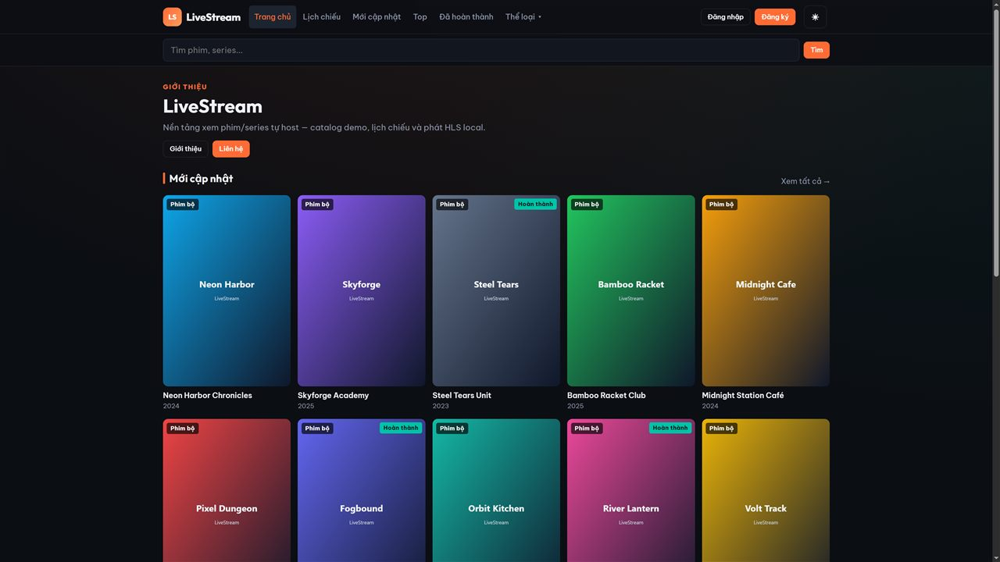
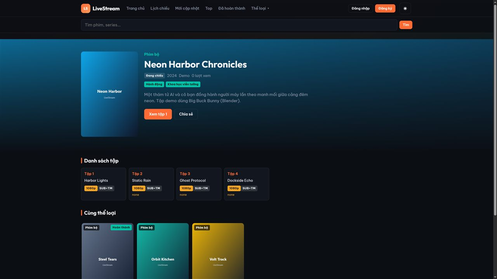
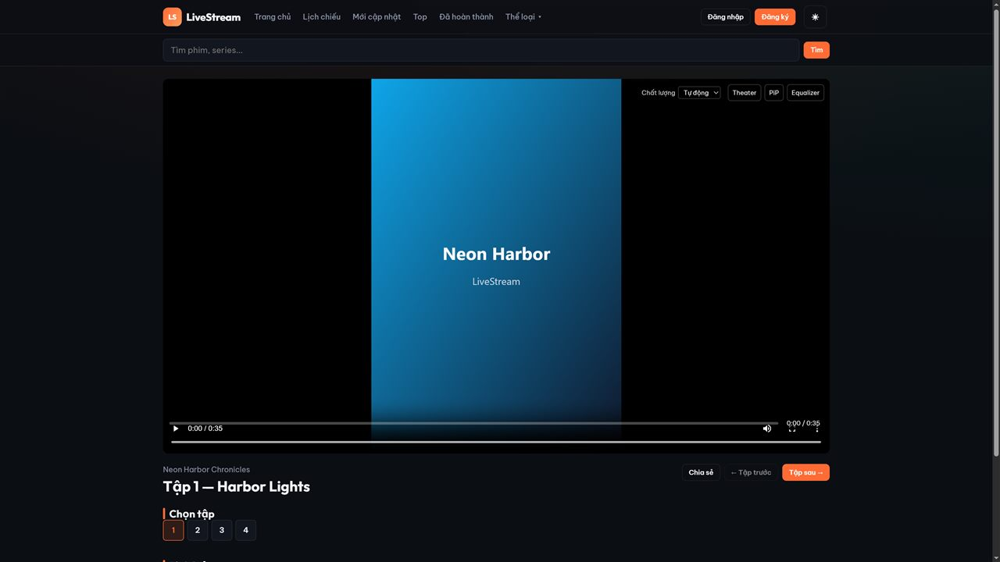
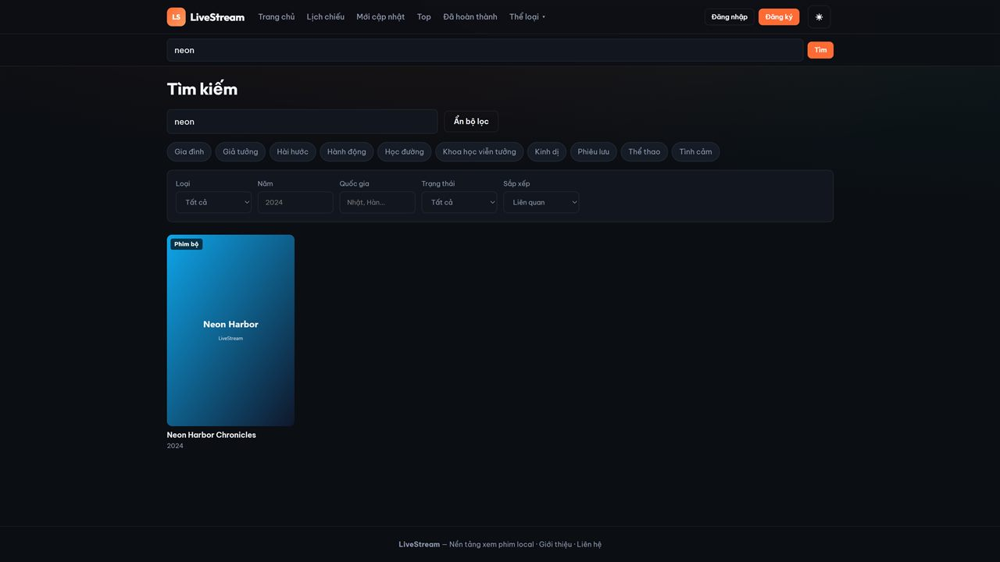
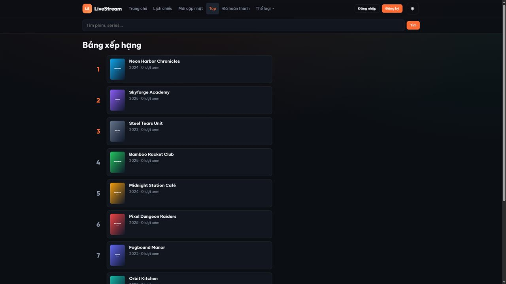
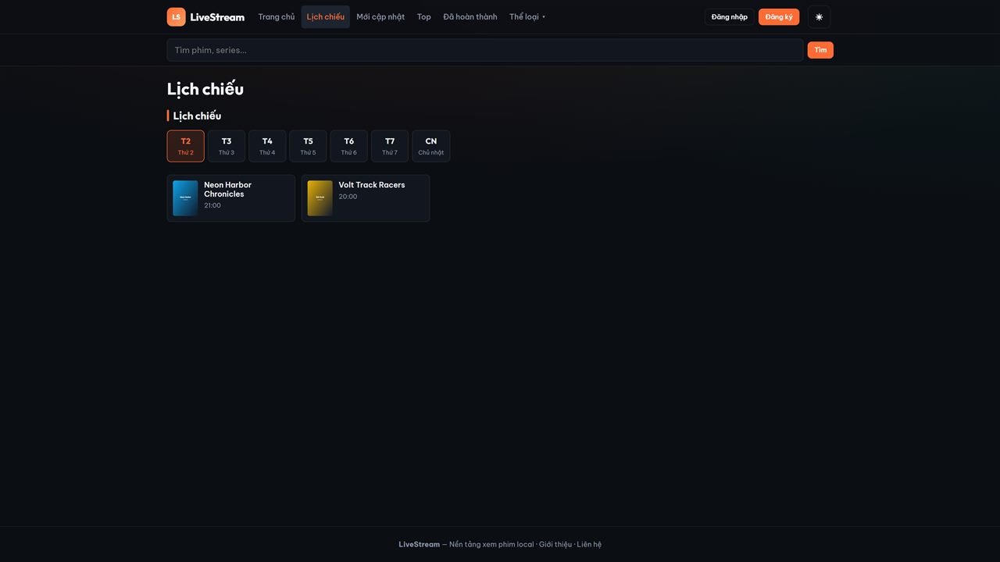
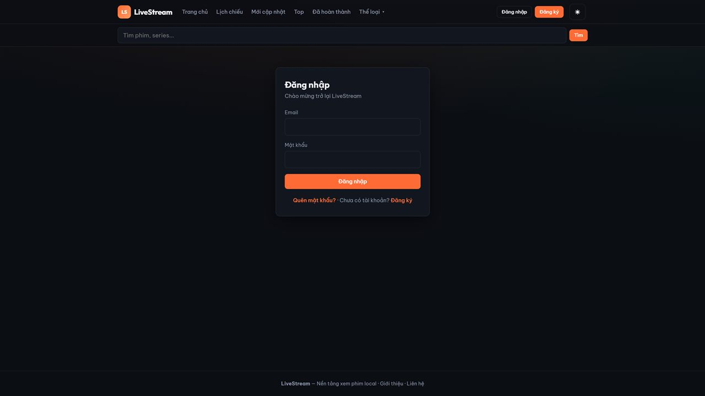
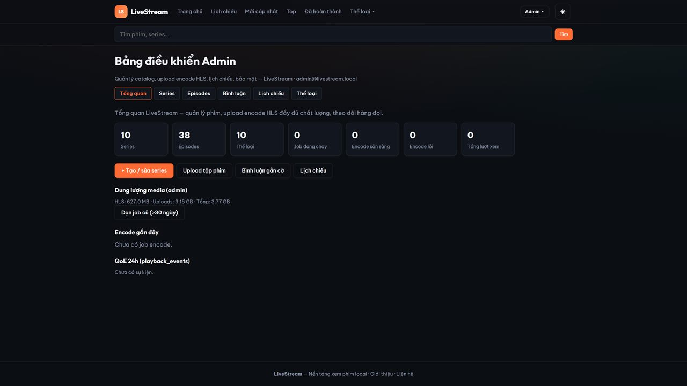
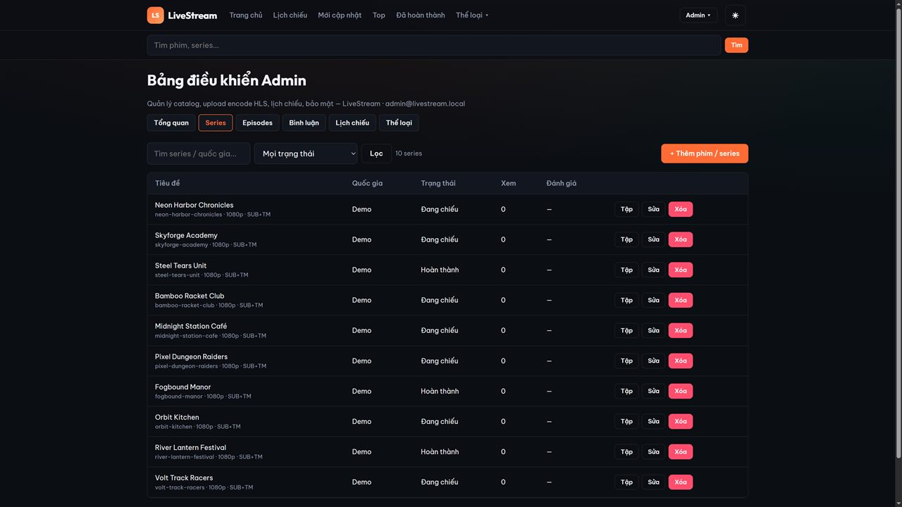

# LiveStream

Nền tảng xem phim/anime **self-host** — thương hiệu **LiveStream**.  
API Fastify + SQLite + ffmpeg HLS, frontend React (Vite + hls.js).

> Catalog demo dùng metadata giả + video mở (Blender / Google sample). **Không** scrape nội dung bản quyền.

## Dùng thử nhanh

| Cách | Lệnh | URL |
|---|---|---|
| **Local dev** | `npm run db:migrate && npm run db:seed-if-empty && npm run demo:encode && npm run dev` | http://localhost:5173 |
| **Docker local (HTTP :8080)** | xem [Deploy — smoke local](#production-docker) | http://localhost:8080 |
| **VPS production** | [`deploy.md`](./deploy.md) + `scripts/vps-bootstrap.sh` | `https://YOUR_DOMAIN` |

Seed mặc định: **2 series** có tập demo encode được (Neon Harbor, Skyforge). Admin upload thêm nội dung thật qua `/admin/wizard`.

## Screenshots

### Trang chủ — catalog & discovery



### Chi tiết phim — metadata, tập, cùng thể loại



### Player HLS — chất lượng ABR, Theater, PiP, Equalizer



### Tìm kiếm — lọc thể loại, loại, năm, quốc gia, trạng thái



### Bảng xếp hạng



### Lịch chiếu theo ngày trong tuần



### Đăng nhập / tài khoản



### Admin — tổng quan encode, disk, QoE



### Admin — quản lý series / catalog CMS



Chi tiết tính năng: [`features.md`](./features.md).

## Tài liệu

| File | Nội dung |
|---|---|
| [`features.md`](./features.md) | Toàn bộ tính năng đã xây |
| [`deploy.md`](./deploy.md) | **Production (Docker)** + VPS / Cloudflare / smoke test |
| [`docs/DEPLOY_TEST_RESULTS.md`](./docs/DEPLOY_TEST_RESULTS.md) | Kết quả verify deploy gần nhất |
| [`docs/CLOUDFLARE.md`](./docs/CLOUDFLARE.md) | DNS, SSL Full (strict), cache HLS |
| [`docs/SUPABASE.md`](./docs/SUPABASE.md) | Storage posters (optional) + Postgres roadmap |
| [`docs/ADMIN.md`](./docs/ADMIN.md) | Tài khoản seed, route admin, upload→encode |
| [`docs/STREAMING_RESEARCH_UPGRADE_PLAN.md`](./docs/STREAMING_RESEARCH_UPGRADE_PLAN.md) | Roadmap UX streaming (P0–P2) |
| [`docs/PROJECT_AUDIT.md`](./docs/PROJECT_AUDIT.md) | Audit toàn diện |
| [`web/README.md`](./web/README.md) | Ghi chú frontend ngắn |

## Stack

- **Server:** Node 20+, Fastify 5, better-sqlite3, JWT + refresh cookie, multipart / chunked upload, encode queue (ffmpeg)
- **Web:** React 19, Vite 8, React Router, hls.js (ABR + slow-net defense)
- **Media:** HLS VOD (fMP4, segment ~5s), ABR ladder 480p → 1080p
- **DB / files:** SQLite (`data/livestream.db`), media dưới `media/` (uploads + hls)
- **Prod:** Docker Compose — `api` + `web` + Caddy (+ optional `worker`)

## Architecture (HLS / ABR)

```text
Upload / demo source
        │
        ▼
   encode queue (ffmpeg)
        │  ladder H.264+AAC → HLS fMP4 ~5s
        ▼
  media/hls/<episodeId>/master.m3u8
        │
        ▼
  Caddy /media/hls/* (file_server)  +  HlsPlayer (hls.js ABR)
```

## Requirements

- Node.js **20+**, npm **10+** (local)
- **ffmpeg** / **ffprobe** — `.env` → `PATH` → npm installer packages
- **Docker Engine + Compose plugin** (production / smoke)

## Quick start (Windows PowerShell)

```powershell
cd C:\Users\ATK\Desktop\StreamSqueeze
Copy-Item .env.example .env -ErrorAction SilentlyContinue
npm install
npm run db:migrate
npm run db:seed-if-empty   # chỉ seed khi DB trống — KHÔNG xóa upload đã có
npm run demo:encode        # tạo HLS demo (2 tập) — cần mạng lần đầu
npm run dev                # API :4000 + Web :5173
```

> **Persistence:** Upload → SQLite `data/livestream.db` + `media/uploads` + `media/hls`.  
> `npm run dev` **không** wipe. Chỉ `db:seed` / `db:reset` mới xóa catalog.

| Surface | URL |
|---|---|
| Web UI | http://localhost:5173 |
| API health | http://localhost:4000/api/health |
| Admin | http://localhost:5173/admin (sau login) |

## Production (Docker)

Hướng dẫn đầy đủ: **[`deploy.md`](./deploy.md)**.

### Smoke local (không cần domain)

```bash
cp .env.production.example .env.production
# DOMAIN=localhost
# CORS_ORIGIN=http://localhost:8080
# COOKIE_SECURE=false
# JWT_* = openssl rand -hex 32 (không dùng change-me-access-secret-dev-only)
# SEED_ADMIN_PASSWORD=... mạnh
# AUTO_DEMO_ENCODE=1   # encode 2 tập demo lúc boot (vài phút)

docker compose -f docker-compose.yml -f docker-compose.local.yml --env-file .env.production up -d --build
# chờ healthy rồi:
#   bash scripts/ci-docker-smoke.sh
#   # hoặc PowerShell:
#   .\scripts\docker-smoke.ps1 -AdminPassword '...' -WaitHlsSec 600
```

Mở http://localhost:8080 — đăng nhập admin trong `.env.production`.

### VPS (domain + HTTPS)

```bash
git clone <repo> LiveStream && cd LiveStream
cp .env.production.example .env.production
# DOMAIN=livestream.example.com
# CORS_ORIGIN=https://livestream.example.com
# JWT_* + SEED_ADMIN_* (bắt buộc đổi)
chmod +x scripts/vps-bootstrap.sh
./scripts/vps-bootstrap.sh
```

## Demo HLS

- Local: `npm run demo:encode` (fast 480p) hoặc `$env:DEMO_FULL=1; npm run demo:encode`
- Docker first boot: `AUTO_DEMO_ENCODE=1` chạy `bootstrap-demo-hls` (không wipe DB)
- Sau seed mới: Neon Harbor = ep **1**, Skyforge = ep **2**

| Series | Playback |
|---|---|
| Neon Harbor Chronicles | `/xem/neon-harbor-chronicles/1` |
| Skyforge Academy | `/xem/skyforge-academy/1` |

## Tài khoản & admin

Xem **[`docs/ADMIN.md`](./docs/ADMIN.md)**. Mặc định local: `admin@livestream.local` / `admin123` — **đổi trước khi mở VPS**.

Admin routes: `/admin`, `/admin/wizard`, `/admin/series`, `/admin/episodes`, …

## Scripts (repo root)

| Command | Mô tả |
|---|---|
| `npm run dev` | API + Web cùng lúc |
| `npm run db:migrate` | Schema SQLite |
| `npm run db:seed-if-empty` | Seed khi chưa có user |
| `npm run db:seed` | Seed lại (**xóa catalog**) |
| `npm run demo:encode` | Tải + encode open movies (có reseeds) |
| `npm run build` / `npm run start` | Build & chạy API production-style |
| `scripts/ci-docker-smoke.sh` | Smoke HTTP stack |
| `scripts/docker-smoke.ps1` | Smoke trên Windows |
| `scripts/vps-bootstrap.sh` | Compose up trên VPS |

## Env

- Local: [`.env.example`](./.env.example)
- Docker: [`.env.production.example`](./.env.production.example) → `.env.production`

## Layout

```text
StreamSqueeze/
  server/     # Fastify + SQLite + encode
  web/        # React (Vite + hls.js)
  deploy/     # Caddyfile, nginx-web.conf
  media/      # uploads + hls (gitignored)
  data/       # SQLite (gitignored)
  scripts/    # dev / docker smoke / vps bootstrap
  docs/       # ops & plans
```

## API (tóm tắt)

**Public:** `GET /api/home`, `/api/series`, `/api/series/:slug/episodes`, `/api/search`, `/api/schedule`, …

**Auth:** `POST /api/auth/login|register|refresh`, `/api/me/*`

**Admin:** CRUD series/episodes, chunked upload, jobs, wizard metadata — Bearer JWT (`admin` \| `editor`)
